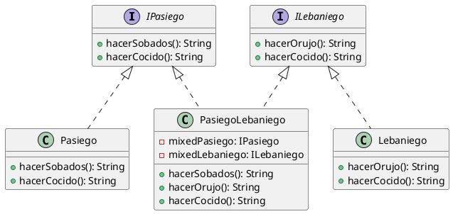

<h2 style="text-align: center; color:#22aaff">
Plan de pruebas US 505814-Mostrar puntos de interés
</h2>

 

## Pruebas de UI

Son las mismas pruebas que las pruebas de aceptación, renombradas como “UI.x”. Los datos de los puntos de interés se filtran en base a las [tablas de datos](#tablas-de-datos) situadas al final del documento.

| Identificador | Entrada | Resultado |
|---------------|---------|-----------|
| UI.1 | [puntos_interes_ejemplos_1](#puntos_interes_ejemplos_1) | muestra: [ punto 3, punto 1, punto 2] |
| UI.2 | [puntos_interes_vacio](#puntos_interes_vacio) | muestra que no hay puntos | 
| UI.3 | [puntos_interes_ejemplos_1](#puntos_interes_ejemplos_1) | muestra: [ punto 3, punto 1, punto 2] |

 

## Pruebas de unitarias

En esta historia de usuario se accede a persistencia de datos, pero como esta esta hecha con room no es necesario probarla. También tiene una capa de negocio de la clase  `InterestPoint`  pero como es una clase unicamente de datos con getters y setters no es necesario probarla. Por lo tanto, las pruebas unitarias solo consistirán en pruebas de las clases de negocio y presentación.

 

### Pruebas unitarias de clases de negocio

Deben de probarse los métodos de la clase `PointsPresenter` mediante el uso de mocks de `IPointsContract#View`, .........

#! TODO ----------------- Indicar que clases se mockean ---------------------------------

Deberían de probarse los siguientes metodos de la clase `PointsPresenter`:

- init( view : IPointsContract.View ) : Void
- onPointClicked( point : InterestPoint ): Void
- onHomeClicked( ): Void

Se va a implementar la prueba unitaria del método **init( view : IPointsContract.View )**:

| Identificador | Entrada | Valor esperado | 
|---------------|---------|----------------|
| UD5.a | DAO con: [puntos_interes_ejemplos_1](#puntos_interes_ejemplos_1) | nada |

 

 

## Pruebas de integración

Para las pruebas de integración se ha añadido las interfaces de `IPointsContract#View`, `IPointsContract#Presenter` y `InterestPointsDAO`

 

## Reporte final

#! TODO ----------------- Indicar que pruebas se han hecho ---------------------------------

 

## Autoría

- Plan de pruebas: Pablo Landeras

- La codificación y ejecución de pruebas unitarias y de integración: Lucía Sañudo

- La codificación y ejecución de pruebas de UI: Adrián del Río

 

## Tablas de datos

Estos son listas de puntos de interés creadas para poder tener datos de prueba y comprobar el comportamiento en todos los casos

### puntos_interes_vacio <a id="puntos_interes_vacio">

| id | name | color | latitude | longitude | radius | creationDate |
|----|------|-------|----------|-----------|--------|--------------|
|----|------|-------|----------|-----------|--------|--------------|

### puntos_interes_ejemplos_1 <a id="puntos_interes_ejemplos_1">

| id | name | color | latitude | longitude | radius | creationDate |
|----|------|-------|----------|-----------|--------|--------------|
| 1 | punto 1 | #ff0000 | 45.0000 | -123.3450 | 12.4 | 12/08/2024 |
| 2 | punto 2 | #00ff00 | 65.0400 | 23.3770 | 6.0 | 10/07/2024 |
| 3 | punto 3 | #0000ff | -25.6783 | 3.3422 | 53.2 | 01/10/2024 |

